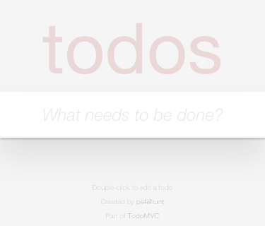
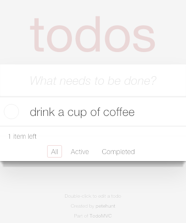
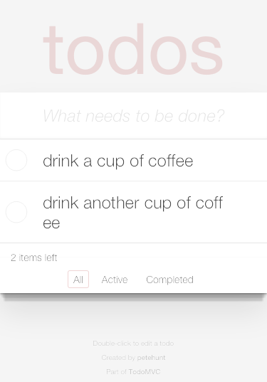
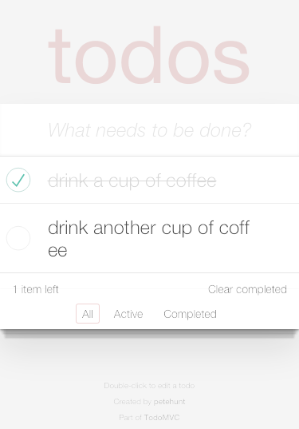
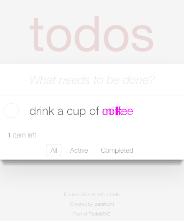

# vbot
A visual regression testing tool, aims to help developers quickly create tests with minimum overhead, avoid repeated clicks and typings in testings, particularly helpful for single page applications or complicated web app. Automate the testings using **Chrome** browser with or without `headless` mode at local dev environment or on a continuous integration server.

There is a [blog post](http://katat.github.io/2017/01/09/vbot/) discussing about the motivation behind `vbot`.

## Requirements

Node 6 or later

Install Chrome 59 or later

## Install
`npm install -g vbot`

### Example

Suppose the test definition is store in `test.json` file. To execute the tests, run the command below.

```bash
vbot -f=test.json
```

vbot will execute the actions defined in the test.json, the schema file,  taking screenshots which will be compared in the end. All the screenshot taken will be in default folder `vbot`.

The `base` is the based image folder and `test` is the newly generated images, while the `diff` have the comparison result images. To rebase the images, use `rebase` flag, such as `vbot -f=test.json --rebase`, the images in the `base` folder will be refreshed.

In addition to the screenshots, it prints out the testings reports at the end of the tests, showing which tests passed or failed with a mismatch percentage compared with the baseline.

Often, there are needs to watch the tests in action in a  browser. The command line tool provides a debug mode to see the tests in action

```bash
vbot -f=test.json -d
```

By default, it runs all the scenarios in a test suit defined in the JSON file. A filter can be specified to only run the scenarios with the names matched. Below command will run the scenarios with the names contains `todo`

```bash
vbot -f=test.json -s todo
```

Let's take a look at how vbot can ease the VRT process. Suppose we want to test this [TODO](http://todomvc.com/examples/react) web app using vbot. We define the interaction flow in a JSON file as below:

```json
{
    "viewWidth": 375,
    "viewHeight": 677,
    "captureSelector": "html",
    "host": "http://todomvc.com",
    "scenarios": [
        {
            "name": "todo test",
            "path": "/examples/react",
            "actions": [
                {
                    "type": "exist",
                    "selector": ".new-todo",
                    "screenshot": true,
                    "comment": "wait for the input element .new-todo appear and take a screenshot"
                },{
                    "type": "typing",
                    "selector": ".new-todo",
                    "value": "drink a cup of coffee",
                    "enter": true,
                    "comment": "enter task message and press 'enter' key"
                },{
                    "type": "exist",
                    "selector": "ul.todo-list li:nth-child(1)",
                    "screenshot": true,
                    "comment": "make sure there is a newly created task in the list and take screenshot"
                },{
                    "type": "typing",
                    "selector": ".new-todo",
                    "value": "drink another cup of coffee",
                    "enter": true,
                    "comment": "create second task"
                },{
                    "type": "exist",
                    "selector": "ul.todo-list li:nth-child(2)",
                    "screenshot": true,
                    "comment": "ensure the second task is created"
                },{
                    "type": "click",
                    "selector": "ul.todo-list li:nth-child(1) .toggle",
                    "comment": "mark the first task as completed"
                },{
                    "type": "exist",
                    "selector": "ul.todo-list li.completed:nth-child(1)",
                    "screenshot": true,
                    "commend": "ensure the completed status is reflected in the view and take screenshot"
                }
            ]
        }
    ]
}

```

## Screenshots
Below are the screenshots captured during the interaction flow:

------------

```json
{
    "type": "exist",
    "selector": ".new-todo",
    "screenshot": true,
    "comment": "wait for the input element .new-todo appear and take a screenshot"
}
```


-------------
```json
{
    "type": "typing",
    "selector": ".new-todo",
    "value": "drink a cup of coffee",
    "enter": true,
    "comment": "enter task message and press 'enter' key"
},{
    "type": "exist",
    "selector": "ul.todo-list li:nth-child(1)",
    "screenshot": true,
    "comment": "make sure there is a newly created task in the list and take screenshot"
}
```


--------------
```json
{
    "type": "typing",
    "selector": ".new-todo",
    "value": "drink another cup of coffee",
    "enter": true,
    "comment": "create second task"
},{
    "type": "exist",
    "selector": "ul.todo-list li:nth-child(2)",
    "screenshot": true,
    "comment": "ensure the second task is created"
}
```


---------------
```json
{
    "type": "click",
    "selector": "ul.todo-list li:nth-child(1) .toggle",
    "comment": "mark the first task as completed"
},{
    "type": "exist",
    "selector": "ul.todo-list li.completed:nth-child(1)",
    "screenshot": true,
    "comment": "ensure the completed status is reflected in the view and take screenshot"
}
```


------------

If this is the first time vbot run the tests for this JSON definition file, the images generated are the baselines. The subsequent tests will compare the newly generated image file with the baselines and highlight the differences if it is not 100% match. For example, let's change the action definition below:

```json
{
    "type": "typing",
    "selector": ".new-todo",
    "value": "drink a cup of coffee",
    "enter": true
}
```

to

```json
{
    "type": "typing",
    "selector": ".new-todo",
    "value": "drink a cup of milk",
    "enter": true
}
```

After re-run the command line above, it should report there is test result mismatch the baseline and generated a image that highlights the difference:

------------------



------------------

## Test options
**viewHeight**
height of the browser view

**viewWidth**
width of the browser view

**host**
The global host of for the test url path in the scenarios. It can use `-d` to override the host at the command.

**scenarios**
Each scenario can comprise of a set of actions in the page view. It groups a set of cohesive tests.
 - **path**  
 The url path for the scenario test to begin with
 - **actions**  
 A set of test steps
   - **type**  
   Action Type: `exist`, `click`, `typing`, `select`, `scroll`
     - `typing`.`enter`
     Set to `true` will press the `enter` key, when using action type `typing`
     - `scroll`.`position`
     The [x, y] increment position to scroll to, when using action type `scroll`
     - `select`.`selectIndex`
     Set an integer (1 based) as an option index of the native dropdown to simulate selecting an option, when using action type `select`
   - **selector**  
   Wait for the element to exist before proceeding to the action type. It is the target element regarding to the action.
   - **scrollTo**
   Set to `true` will scroll the element matched with the selector into the view.
   - **screenshot**  
   Set to `true` for taking screenshot after this step action is executed.
   - **captureDelay**  
   Delay(millisecond) to wait before this step's screenshot is taken.
   - **waitTimeout**  
   Maximum time to wait for the element `selector` exists in the DOM. If waited longer than this setting, it throws error of not found the `selector` element.
   - **comment**
   Used for references of the action, and as the screenshot file name.

## Welcome contributions

Fork and make changes. In the tests directory, run `npm test` to make sure all the tests are passed. Welcome pull requests or request new features.

## License
MIT
