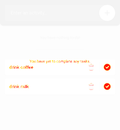

# VBot
> A visual regression testing library/tool, aims to quickly automate browser-based tests with minimum development overhead.

The [article](http://katat.me/2017/01/09/vbot/) describes more details behind the motivation.

## Features
 - **JSON-based**
 test steps, clearer to have one to one action mapping to browser interactions
 - **Chrome**
  is used to automate the testings, can run in headless mode or with a visible browser window during testing
 - **Programming or CLI mode**
 support testing with frameworks like mocha, or with VBot's command line tool
 - **Screenshot Comparison**
 done automatically by comparing with previous screenshots, no more eye workouts!

 

## Preview


## Requirements
 - Node 6 or later
 - Chrome 59 or later

## Install
`npm install vbot`

## Test modes
VBot supports testings in both programming mode or CLI mode.

### Programming mode
To test flexibly in different testing scenarios, either testing against web UI wired with backends or just static web page, VBot exposes API to be used with testing frameworks like [mocha](https://mochajs.org/) or [ava](https://github.com/avajs/ava) etc. Therefore, the test data variables can be updated according to different conditions, in order to decouple from real backends and avoid false negative results.

------------
#### Mocha example

```javascript
describe('examples', () => {
  let vbot
  afterEach((done) => {
    //close chrome instance after each test case
    vbot.close().then(done)
  });
  it('todo', function (done) {
    vbot = new VBot({
      imgdir    : `${testPath}/tmp/screenshots`,//specify custom screenshots' file paths
      rebase    : process.env.REBASE,// rebase, default false
      verbose   : true, //verbose logs, default true
      showWindow: process.env.WINDOW// show Chrome window, default false
    })
    //pass in the playbook JSON
    vbot.start({
      //web page url to open in chrome instance before testing
      url: `file:///${testPath}/fixtures/todo/index.html`,
      //name for this test case. If imgdir option is not specified, it will use this name as a screenshot folder
      scenario: "todo",
      //size for the chrome instance window
      size: {width: 375, height: 677},
      //test steps that will be executed in order
      actions: [
        //For all the support actions types and related attributes, please refer to the action tests
        {type: "click", selector:"input#item"},
        {type: "typing", value: "drink milk", enter:true, tab:false},
        {type: "typing", value: "drink coffee", enter:true, tab:false},
        {type: "typing", value: "go to work", enter:false, tab:false},
        {type: "click", selector:"button#add>svg"},
        //comment will be used as the screenshot file name, otherwise selectorstring will be used
        {type: "click", comment: "done milk", selector:"ul#todo>li:nth-child(3)>div>button:nth-child(2)>svg", screenshot:true},
        {type: "click", comment: "done coffee", selector:"ul#todo>li:nth-child(2)>div>button:nth-child(2)>svg", screenshot:true},
        {type: "click", comment: "remove work", selector:"ul#todo>li>div>button:nth-child(1)>svg", screenshot:true},
        {type: "reload", comment: "reload page", screenshot:true}
      ]
    })
    vbot.on('action.executed', (log) => {})//event when an action executed successfully
    vbot.on('screenshot.diff', (data) => {})//event when there are differences from screenshot comparison
    vbot.on('action.fail', (log) => {})//event when an action failed to execute
    vbot.on('end', () => {//event when test case ended
      done()
    })
  });
});
```

The code above is from the [test case](test/src/example-todo.js).

To see how this example work in action, you can clone code of this repository and go to the folder in command line, install the node modules by `npm install`.

Then you can get a feeling of how it works by running following test commands that runs mocha tests.

##### *Headless mode*
To run the demo todo app test and take screenshot:

`npm test -- -g "todo"`

It will execute the test with Chrome in headless mode. You should see the verbose logs, and screenshots taken in folder `/test/tmp/screenshots/todo`

##### *Visible mode*
To see the tests running on Chrome visibly:

`WINDOW=true npm test -- -g "todo"`

##### *Screenshot comparison*
The result of the screenshot comparison are the screenshots with difference highlighted. Let's modify the [TODO](test/fixtures/todo) app to disable the `localStorage` related logics, and run the example above again in headless mode.

Now there should be one `diff` screenshot created for the last action step, which is the screenshot after reloaded the web page, because of the modified code leading to a different `test` screenshot:


##### *Rebase*
Try to update tests or the code in the demo todo app and VBot should automatically highlight the differences of the screenshots between previous and current version.

To rebase screenshots:

`REBASE=true npm test -- -g "todo"`

--------------------

### Playbook schema
The schema is defined using [ajv](https://github.com/epoberezkin/ajv). For the schema details, please refer to [playbook schema definitions](src/schema/playbook.json)

### Supported actions
Please refer to respective [mocha tests](test/src/actions.js)

### Screenshot directory
```
├── scenario name
      ├── base //baseline screenshots
      ├── test //screenshots from last test
      └── diff //screenshots with differences highlighted
```

### Events

 - `action.executed` when an action executed successfully
 - `screenshot.diff` when there are differences from screenshot comparison
 - `action.fail` when an action failed to execute
 - `end` when test case ended

### CLI mode
Please see [CLI readme](cli.md)

## Chrome extension
There is a Chrome extension facilitate recording the interactions in a web page using the [playbook](#playbook-schema) schema. The playbook JSON exported can be run in either the programming mode as shown in above example or in CLI mode.


To run in CLI mode with the exported JSON file, just run:

`vbot -f /path/to/playbook/json/file -d`

It will bring up a Chrome browser and you can see the tests in action.
Or you can run it without the `-d` argument, so that it will execute the tests in headless mode which that will take screenshots and do comparisons with the previous tests:

`vbot -f /path/to/playbook/json/file`

## Contributions
Welcome any feedbacks, questions or contributions, just feel free to post issues.

## License
MIT
